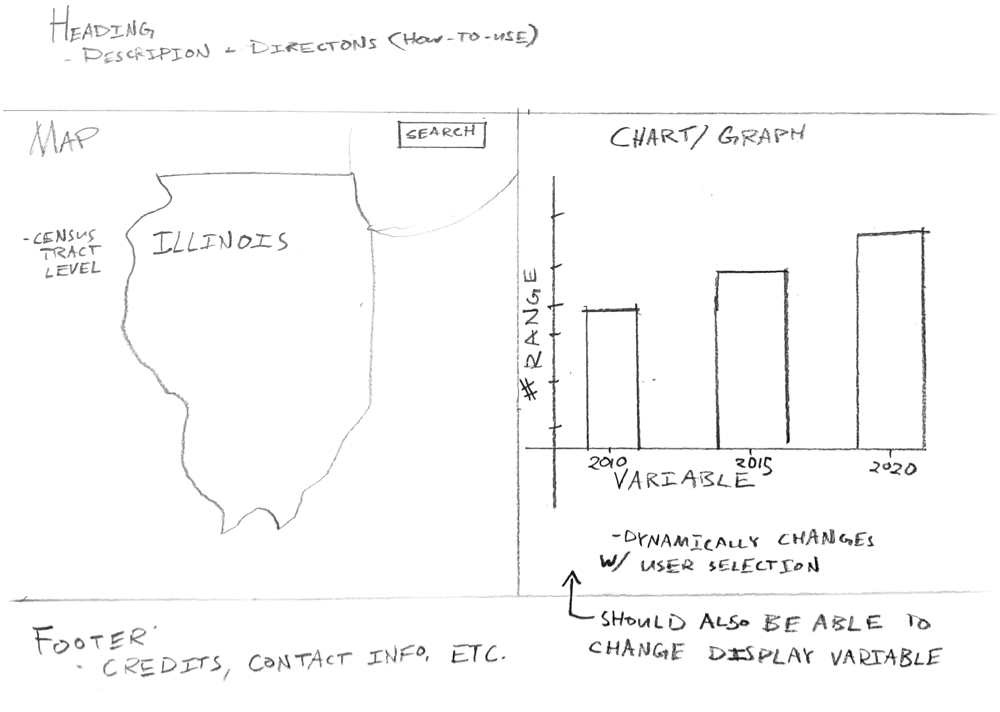

# Final Project - GEOG 575

Andy Donakowski, Fall 2023

## Project Proposal

## Description

Throughout the year, the Illinois Housing Development Authority (the Authority) receives applications for affordable home financing. The Market and Analytics team evaluates these project applications and reviews market areas new potential sites to ensure housing in going in areas where it is needed. As part of this process, members of the team select market areas based on groupings of census tracts around the proposed site and explore economic and demographic characteristics for the area. Typically this is down with a computer script that creates a spreadsheet with relevant information. However, it has been proposed that enhanced visualization could improve the evaluation process. It is suggested that an interactive map with corresponding data visualization could allow the analysts to better explore the market areas.

### Persona

Lisa is the coordinator of the Market and Analytics team. She has been with the Authority for almost 40 years. She is deeply knowledgeable of the evaluation process and local housing market trends. However, she is not as technically savvy as some of the other Authority employees. Despite a general hesitation to new software and technology, she is well-versed at the computer programs she uses in her work. Her main Achilles heel, technologically speaking, is learning new software. 

### Scenario

After receiving a batch of project applications, Lisa and her team must go through the proposals, find project locations, and determine market areas surrounding potential projects. As part of the analysis, Lisa would like to see general economic and demographic characteristics for the selected areas. Selecting market areas should be done at the tract level, so that a grouping of contiguous tracts will make up the general area of analysis for projects. This process should allow for easy exploration of different market area configurations. It will need to be repeated multiple times for different applications. 

Because the typical user is hesitant of new technologies, the interface should be simple, provide enough information needed but not more, and easy to navigate. In order to find  First, because users will be searching for particular areas, search functionality should be included in the web-map. Next, economic and demographic data should be included at the tract level. Users should be able to select and de-select these areas while determining appropriate tact configurations for market areas. Data should be aggregated based on tracts selected by the user. Additionally, the user should be able to 

### Requirements Document

| Representation       | Format   | source           | notes                       |
| -------------------- | -------- | ---------------- | --------------------------- |
| economic data        | tabular  | US Census Bureau |                             |
| demographic data     | tabular  | US Census Bureau |                             |
| census tracts for IL | topojson | Census Bureau    | stylized with neutral color |
| basemap              | web api  | leaflet          | nothing fancy               |

| Interaction          | Notes                                                                           |
| -------------------- | ------------------------------------------------------------------------------- |
| interactive map      | user should be able to pan and zoom; select features                            |
| bar chart            | include multiple variables that adjusts with user input                         |
| search functionality | map should allow user to search for location, zoom to location, and mark on map |

### Wireframe

### Video

#### Video file

[Video file](../video/Final%20-%20Geog%20-%20575%20-%20Fall%202023.mp4)

#### Web link for video

[Link to video](https://www.canva.com/design/DAF3D09kyGQ/cDvldw1GL_dEZ31vVb3iww/watch?utm_content=DAF3D09kyGQ&utm_campaign=designshare&utm_medium=link&utm_source=editor)

### Script for Video

The Marketing and Analytics team at the Illinois Housing Development Authority is tasked with evaluating affordable housing project proposals that come to the organization. Each project proposal site must be evaluated using economic and demographic characteristics of the proposed site. In order to do this, the team selects a representative market area around the project site based at the census tract level and evaluates key characteristics for the area. Typically this is shown through information pulled together into a spreadsheet.

The Illinois Tract Data Select allows greater flexibility and improved data visualization for the analysts by allowing for easy tract selection and dynamic data visualizations. To use it, one can enter in a site address. The interactive map will zoom to the area from the search and mark its location. The user can then select census tracts around the site to determine a market area. As tracts are selected, the bar chart to the right will automatically update to display a summary of different characteristics.

Data summarized in the chart can be changed by selecting a different variable from the dropdown menu below the chart. Census tracts can be removed from the selection by clicking on it again. If a user would like to remove all tracts from the selection, they can do so by selecting the "clear selection" button on the map.

This visualization allows for more fluid and dynamic exploration of potential market sites and could greatly improve project application analysis. 

 
